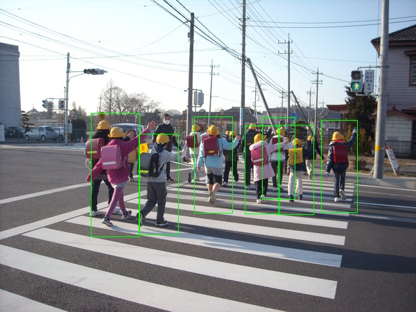
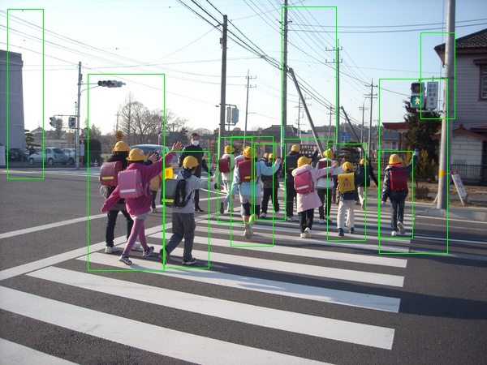

# Pedestrian-Detection
Run pedestrian detector based on python + opencv

|Detector|INRIA|Daimler|
|---|:---:|:---:|
|Result|| |

#### Files Description
|Files|Description|
|---|---|
|PD_2016.ipynb|Starting Point of Pedestrian Detection with explanations|
|PD_2016.py|Starting Point of Pedestrian Detection|
|HOGVisualization_2016.ipynb|Visualize HOG + NMS Test|

#### TODO
* Add pipeline for movie
* Add pipeline for usbcam
* Add tracking module
* Compare with Deep Learning Approach (e.g. SSD)
* Post consideration as blog
